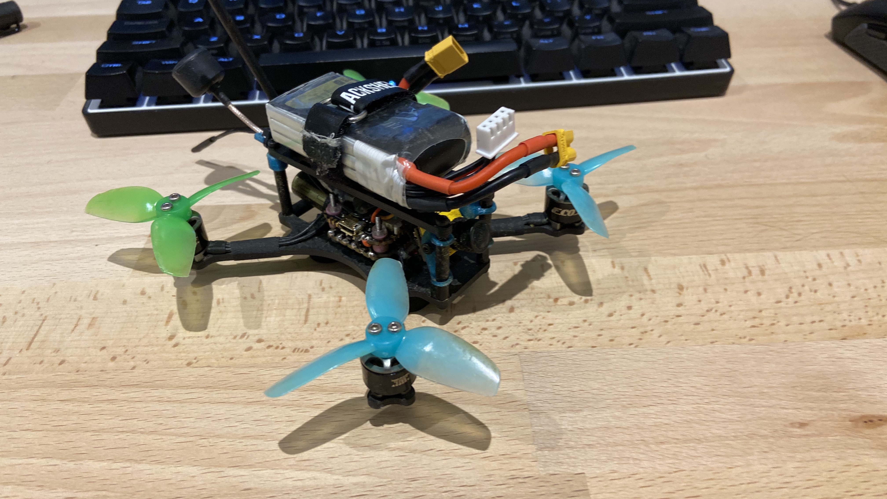

# Source Micro

Frame: TBS Source Micro  
FC/ESX: Diatone Mamba F405 Mini MK3  
Motors: EMAX 1106 4500kv  
Propellers: HQprops 3x2.5x3.5  
Batterie: Tattu 3S 650mAh  
RX: TBS Crossfire Nano  
RX Antenna: Crossfire L shape  
VTX: TBS Unify Pro32 Nano  
VTS Antenna: TBS Triumph Pro U.FL  

TX: TBS Tango 2  
Goggle: Skyzone sky03o  

Camera Mount + Antenna Support
