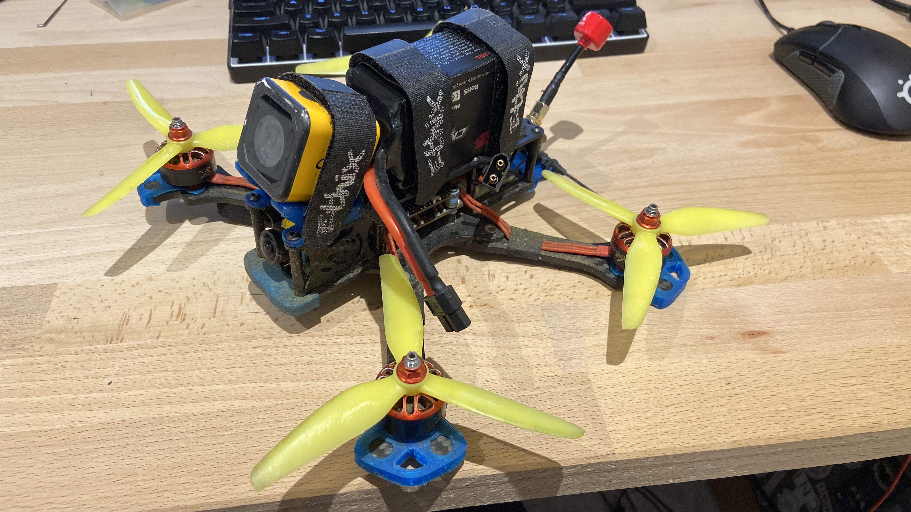

# Source One 

Frame: TBS Source One  
FC/ESX: Diatone Mamba F405 MK3  
Motors: iFlight XING-E 2208 1800kv  
Propellers: Ethix S4  
Batterie: CNHL 6S 1300mAh  
RX: TBS Crossfire Nano  
RX Antenna: Crossfire Immortal-T  
Camera FPV: Caddx Ratel Micro  
VTX: TBS Unify Pro HV  
VTX Antenna: Foxeer Lolipop 3 SMA 
Camera HD: Caddx Orca  
Buzzer: ViFly 2 

TX: TBS Tango 2  
Goggle: Skyzone sky03o  

Camera Mount + RX/VTX Antenna Support
